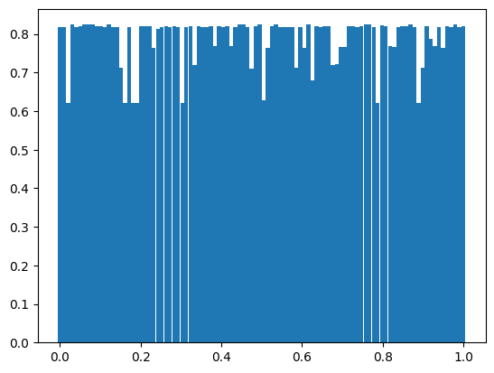
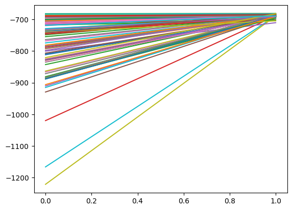
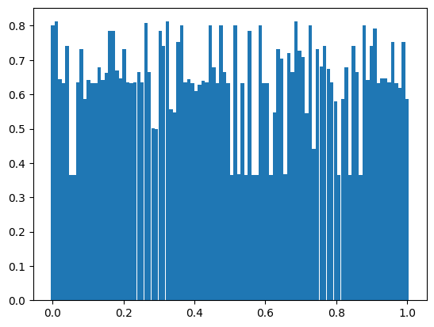

In the file `weather_hmm_continuous.ipynb` I have reconstructed the weather HMM from the previous implementation, but with a more interesting approach. I have extended the set of possible states from {rain, no rain} to {rain and warm, rain and cold, dry and warm, dry and cold}, but most importantly made the observation space a continuous length-2 vector (temperature, rain_intensity).

A few interesting things change in the implementation.

Now, instead of $B$ being a static $N\times M$ matrix where $B_{i,k}=\mathbb{P}(\text{emitted observation }k\text{ in state }i)$ (where $N$ is the amount of states and $M$ the amount of observable states), now $B$ is a $T\times N$ matrix where $B_{t,i}=b_t(i)$ is the probability distribution of observation witnessed at time $t$ for state $i$. Here, $O_t$ is a stochastic variable following a multivariable Gaussian distribution, with mean $\mu_i$ being the mean observation vector of state $i$ (two components here) and covariance matrix $\Sigma_i$ encoding the interdependence and relative variance between the labels "temperature" and "rain intensity" of state $i$. So we can calculate $b_t(i)$ by computing the PDF function of the multivariate Gaussian distribution with parameters $\mu_i$ and $\Sigma_i$. However, since we are working with logarithms, we will be computing the log of this value.

We use the formulas

$\mu_i=(\sum_{t=1}^T\gamma_t(i)x_t)/(\sum_{t=1}^T\gamma_t(i))$

$\Sigma_i=(\sum_{t=1}^T\gamma_t(i)(x_t-\mu_t)(x_t-\mu_T)^T)/(\sum_{t=1}^T\gamma_t(i))$

where $x_t$ is the datapoint of dimension $N$ at observed time $t$ (in this case, $N=2$), $\mu_i$ the mean values of the observations for state $i$ and similarly for $\Sigma_i$. So we essentially just take a weighted sum, weighted by the responsibilities $\gamma_t(i)$.   

#### Evaluation

For the evaluation step, a few things change as well.  
Instead of computing the permutation indices (by using the Hungarian method again) by using $B$, now we cannot do this, because $B$ isn't a static $M\times N$ matrix anymore. We instead obtain the permutation indeces by matching using the true and estimated values of $\mu$ and $\Sigma$.

For this, we use a measure of statistical difference called the KL-divergence.

https://en.wikipedia.org/wiki/Kullback%E2%80%93Leibler_divergence

We will compute the "difference" between $\Sigma_{\text{estimated}}$ and $\Sigma_{\text{real}}$ using this method, but because this function is not symmetric, we will compute

$D_{\text{sym}}(P,Q)=D_{KL}(P\ |\ Q)+D_{KL}(Q\ |\ P)$

with $P=\Sigma_{\text{estimated}}$ and $Q=\Sigma_{\text{real}}$, as the measure we will use for permuting the matrices.  
For the multivariate normal distribution, there exists a close form of this formula:

$D_{KL}(\mathcal{N}(\mu_1,\Sigma_1)\ |\ \mathcal{N}(\mu_2,\Sigma_2))=\frac{1}{2}(\text{Tr}(\Sigma_{2}^{-1}\Sigma_{1})+(\mu_2-\mu_1)^T\Sigma_{2}^{-1}(\mu_2-\mu_1)-d+\text{log}(\text{det}\Sigma_2/\text{det}\Sigma_1))$

with $d$ being the dimensionality of the data (2 in this case).  
We can then construct a distance matrix $C\in\mathbb{R}^{M\times M}$ where

$C_{i,j}=D_{\text{sym}}(\Sigma_{i}^{\text{estimated}}\ |\ \Sigma_{i}^{\text{real}})$

and then use the Hungarian algorithm on this cost matrix.

##### Viterbi

Not much changes here, except for the fact that we have to modify the calculation for $\delta$ a bit, since the structure of $B$ is different now.

##### Predictions when future observations are unknown

For this step, the only thing that changes is the fact that now we use the argmax of the mean temperature and rain values for each state, instead of deriving it using $B$. We also have, of course, that the predicted observation structure is now a $T\times 2$ matrix (rows for temperature and rain):

$\bar{O}_{T,m}=\underset{j}{\mathrm{argmax}}\ \mu_{j,m}$

We then compute the predicted observation at time $t$ and feature $m$ (here we have $m\in\{0,1\}$):

$\bar{O}_{t,m}=\pi\mu_{:,m}$

where $\mu_{:,m}$ is the m-th column of $\mu$.

### Experimenting with initial parameter guesses

For both of the intstances of the weather HMM, I wanted to experiment how far or close the estimated parameters come during the training to the actual parameters.

To research this, I experimented with the initial parameter distribution for $A$, $B$, and $\pi$ by modifying their generation algorithms.

I started out by simply adding noise to the true values and making sure all probabilities where in the bounds of 0.01 and 0.9:

```
A_first_col = np.clip(A_real_first_col + np.random.normal(0, 0.2, 2), a_min=0.01, a_max=0.9)
A = np.empty((2, 2))
A[:, 0] = A_first_col
A[:, 1] = 1 - A_first_col

B_first_col = np.clip(B_real_first_col + np.random.normal(0, 0.05, 2), a_min=0.01, a_max=0.9)
B = np.empty((2, 2))
B[:, 0] = B_first_col
B[:, 1] = 1 - B_first_col

p = np.clip(pi_real[0] + np.random.normal(0, 0.05), a_min=0.01, a_max=0.9)
pi = np.array([p, 1 - p])
```

This, expectedly so, worked very well. If we look at the convergence of the log-likelyhood:


And the distribution of the fraction of correct state guesses when having used the viterbi algorithm:



The best and worst fraction of correct guesses looks like

```
maximum pct correct: 0.8240000000000001 from attempt 4
minimum pct correct: 0.62 from attempt 3
```

I then experimented by using a uniform distribution to make the initial guesses, instead of having to rely on the true parameters.

```
A_first_col = np.random.uniform(0.3, 0.7, 2)
A = np.empty((2, 2))
A[:, 0] = A_first_col
A[:, 1] = 1 - A_first_col

B_first_col = np.random.uniform(0.3, 0.7, 2)
B = np.empty((2, 2))
B[:, 0] = B_first_col
B[:, 1] = 1 - B_first_col

p = np.random.uniform(0.3, 0.7)
pi = np.array([p, 1 - p])
```

This method of parameter initialization is clearly more realistic. If we look at the log-likelyhood distribution in this case, we can see:



And the distribution of the fraction of correct state guesses when having used the viterbi algorithm:



The best and worst fraction of correct guesses looks like

```
maximum pct correct: 0.812 from attempt 2
minimum pct correct: 0.366 from attempt 6
```

What is interesting is that using both methods, we can see that pretty much all log-likelyhood values converge to about the same value. However, the error term in the parameter estimations (second plot) is larger in the second attempt, which makes intuitive sense. We can also see the distribution of the fraction of correct state estimations varies more in the second attempt, which again makes sense because we are spreading our guesses more.