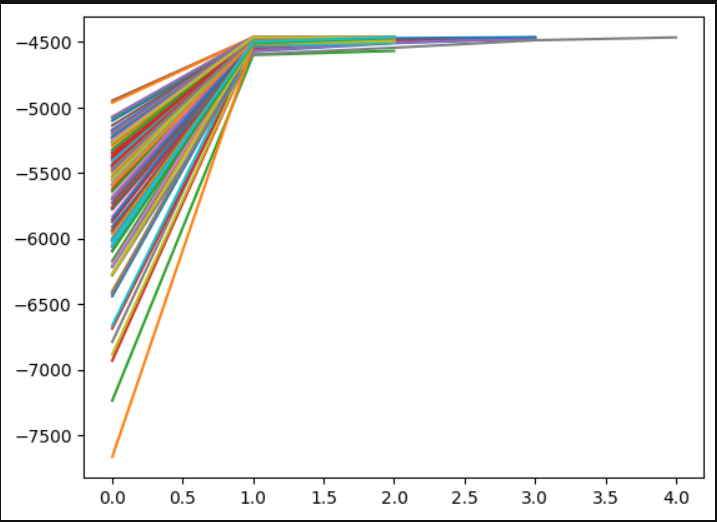
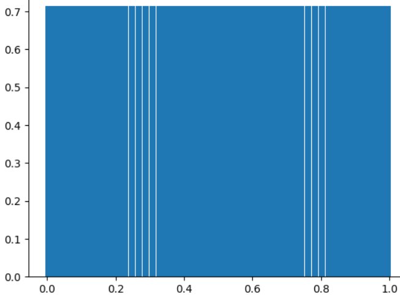
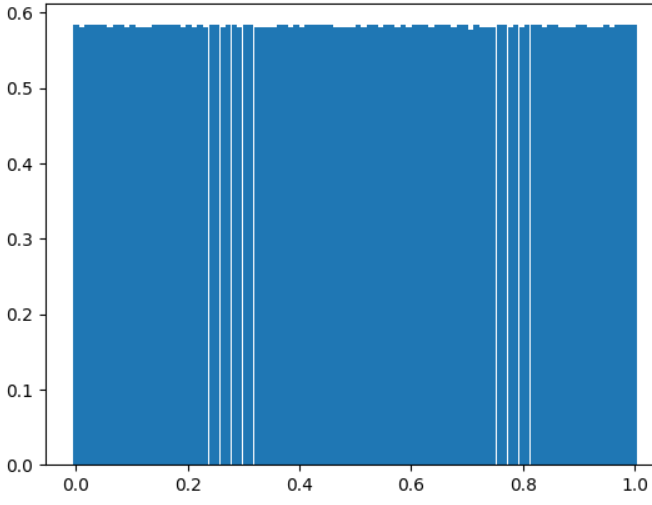

In the file `weather_hmm_continuous.ipynb` I have reconstructed the weather HMM from the previous implementation, but with a more interesting approach. I have extended the set of possible states from {rain, no rain} to {rain and warm, rain and cold, dry and warm, dry and cold}, but most importantly made the observation space a continuous length-2 vector (temperature, rain_intensity).

A few interesting things change in the implementation.

Now, instead of $B$ being a static $N\times M$ matrix where $B_{i,k}=\mathbb{P}(\text{emitted observation }k\text{ in state }i)$ (where $N$ is the amount of states and $M$ the amount of observable states), now $B$ is a $T\times N$ matrix where $B_{t,i}=b_t(i)$ is the probability distribution of observation witnessed at time $t$ for state $i$. Here, $O_t$ is a stochastic variable following a multivariable Gaussian distribution, with mean $\mu_i$ being the mean observation vector of state $i$ (two components here) and covariance matrix $\Sigma_i$ encoding the interdependence and relative variance between the labels "temperature" and "rain intensity" of state $i$. So we can calculate $b_t(i)$ by computing the PDF function of the multivariate Gaussian distribution with parameters $\mu_i$ and $\Sigma_i$. However, since we are working with logarithms, we will be computing the log of this value.

We use the formulas

$\mu_i=(\sum_{t=1}^T\gamma_t(i)x_t)/(\sum_{t=1}^T\gamma_t(i))$

$\Sigma_i=(\sum_{t=1}^T\gamma_t(i)(x_t-\mu_t)(x_t-\mu_T)^T)/(\sum_{t=1}^T\gamma_t(i))$

where $x_t$ is the datapoint of dimension $N$ at observed time $t$ (in this case, $N=2$), $\mu_i$ the mean values of the observations for state $i$ and similarly for $\Sigma_i$. So we essentially just take a weighted sum, weighted by the responsibilities $\gamma_t(i)$.   

#### Evaluation

For the evaluation step, a few things change as well.  
Instead of computing the permutation indices (by using the Hungarian method again) by using $B$, now we cannot do this, because $B$ isn't a static $M\times N$ matrix anymore. We instead obtain the permutation indeces by matching using the true and estimated values of $\mu$ and $\Sigma$.

For this, we use a measure of statistical difference called the KL-divergence.

https://en.wikipedia.org/wiki/Kullback%E2%80%93Leibler_divergence

We will compute the "difference" between $\Sigma_{\text{estimated}}$ and $\Sigma_{\text{real}}$ using this method, but because this function is not symmetric, we will compute

$D_{\text{sym}}(P,Q)=D_{KL}(P\ |\ Q)+D_{KL}(Q\ |\ P)$

with $P=\Sigma_{\text{estimated}}$ and $Q=\Sigma_{\text{real}}$, as the measure we will use for permuting the matrices.  
For the multivariate normal distribution, there exists a closed formula:

$D_{KL}(\mathcal{N}(\mu_1,\Sigma_1)\ |\ \mathcal{N}(\mu_2,\Sigma_2))=\frac{1}{2}(\text{Tr}(\Sigma_{2}^{-1}\Sigma_{1})+(\mu_2-\mu_1)^T\Sigma_{2}^{-1}(\mu_2-\mu_1)-d+\text{log}(\text{det}\Sigma_2/\text{det}\Sigma_1))$

with $d$ being the dimensionality of the data (2 in this case).  
We can then construct a distance matrix $C\in\mathbb{R}^{M\times M}$ where

$C_{i,j}=D_{\text{sym}}(\Sigma_{i}^{\text{estimated}}\ |\ \Sigma_{j}^{\text{real}})$

and then use the Hungarian algorithm on this cost matrix.

##### Viterbi

Not much changes here, except for the fact that we have to modify the calculation for $\delta$ a bit, since the structure of $B$ is different now.

##### Predictions when future observations are unknown

For this step, the only thing that changes is the fact that now we use the argmax of the mean temperature and rain values for each state, instead of deriving it using $B$. We also have, of course, that the predicted observation structure is now a $T\times 2$ matrix (rows for temperature and rain):

$\bar{O}_{T,m}=\underset{j}{\mathrm{argmax}}\ \mu_{j,m}$

We then compute the predicted observation at time $t$ and feature $m$ (here we have $m\in\{0,1\}$):

$\bar{O}_{t,m}=\pi\mu_{:,m}$

where $\mu_{:,m}$ is the m-th column of $\mu$.

#### Results

Plotting the log-likelyhood values per iteration, we see similar behaviour as with the discrete case.

- 

These show the predicted states following the states from the training data.

- 

And these by using the Viterbi algorithm.

- 

