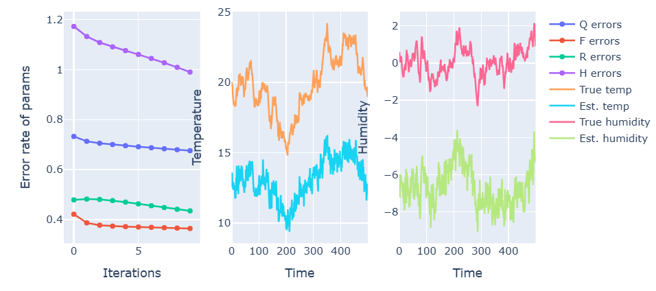
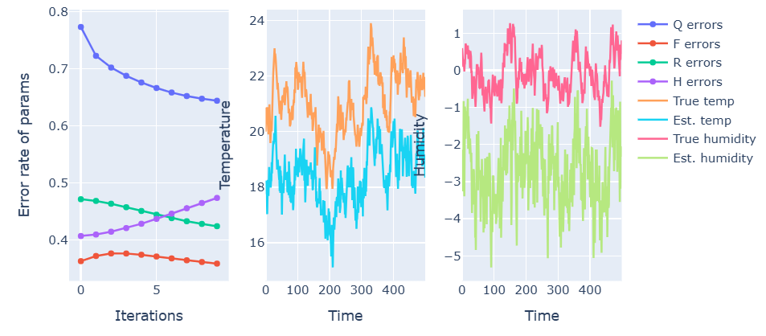
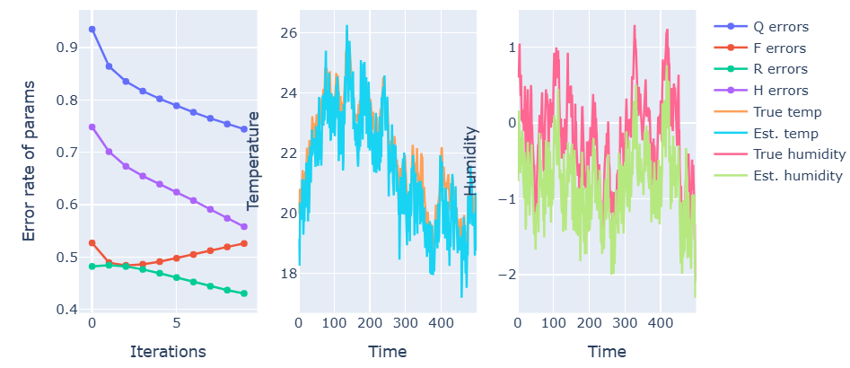

### Linear dynamical systems

We consider a state vector $x_k$ at each discrete timestep $k$. Denote $N$ for the dimensionality of this vector. Let $y_k$ be the observation vector at time $k$ with dimensionality $M$.

The model is assumed to be linear and Gaussian, and is defined as

$x_k=Fx_{k-1}+w_k,\ w_k\sim\mathcal{N}(0,Q)$

$y_k=Hx_k+v_t,\ v_t\sim\mathcal{N}(0,R)$

where:

$F\in\mathbb{R}^{N\times N}$: state transition matrix (how the state evolves)

$H\in\mathbb{R}^{M\times N}$: observation matrix, mapping state to observations

$Q\in\mathbb{R}^{N\times N}$: the process noise covariance

$R\in\mathbb{R}^{M\times M}$: the masurement noise covariance

$w_k$ and $v_k$ is Gaussian noise.

#### Kalman filter

The Kalman filter tracks the best estimate of the state $x_k\sim\mathcal{N}(\hat{x}_k,P_k)$.

##### Prediction of the new state

We make a prediction of $x_k$ before having seen $y_k$ (prior distribution):

$x_{k|k-1}=F{x}_{k-1|k-1}$

$P_{k|k-1}=FP_{k-1|k-1}F^T+Q$

$x_{k|k-1}$ means: the prediction at time $k$ with data up to $k-1$, and similar for $P$.

##### Observing

Upon having observed $y_k$, we get an error term $e_k=y_k-Hx_{k|k-1}$. This variable has a covariance matrix $S_k=HP_kH^T+R$

##### Kalman gain

We define $K_k=P_kH^TS_{k}^{-1}$. This represents a measure of how strongly to correct the predicted state using the observed data. This formula comes from the fact that we want $K$ to minimize the difference between $x_{k|k-1}$ and $x_{k|k}$:

$K=\text{argmin}_K E[|| x_{k|k-1}-x_{k|k} ||]$

##### Updating step

Upon having the error, we update our best guess of the state:

$x_{k|k}=x_k+K_ke_k$

$P_{k|k}=(I-K_kH)P_k$

These are the posterior probabilities.

#### RTS smoother

This is the analogue to the backward step in the Baum Welch algorithm for HMMs. The difference with the Kalman filter: it attempts to account for future as well as past data. It takes in the states returned by the Kalman filter and smoothes $x_t$ and $P_t$, by accounting for future data.

From the Kalman filter, we have obtained the filtered mean $x_{t|t}$, the predicted mean $x_{t+1|t}$, the filtered covariance $P_{t|t}$ and the predicted covariance $P_{t+1|t}$.

Here, $x_{t|s}$ means the best guess of the state vector at time $t$, given observations up to time $s$.

I'm not going to derive the below equations here, as this would take me too much time and resources, but here is an example of one doing this if interested:

https://users.aalto.fi/~ssarkka/course_k2011/pdf/handout7.pdf

##### Backwards Kalman gain (= smoother gain)

This step computes $C_t=P_{t|t}F^TP_{t+1|t}^{-1}$ for $t$ from $0$ to $T-2$.

This essentially represents how much information about the future state $x_{t+1}$ should "go back" to correct the past state $x_t$, meaning small values (entries) for $C_k$ means that the future does not have a big impact on changes in the past.

##### Smoothed mean

$x_{t|T}=x_{t|t}+C_t(x_{t+1|T}-x_{t+1|t})$

This essentially updates ones old belief about $x_t$ using information about the guess for $x_{t+1}$. $x_{t+1|T}-x_{t+1|t}$ represents the "error" term of the prediction.

##### Smoothed covariance

$P_{t|T}=P_{t|t}+C_t(P_{t+1|T}-P_{t+1|t})C_{t}^T$

This represents the amount of extra certainty one has about $x_t$ after having seen future data. $P_{t+1|T}-P_{t+1|t}$ represents the amount of certainty that was "reduced".

#### Estimating F, Q, H and R

We now use the results from the previous step to estimate the wanted parameters of the system: $F$, $Q$, $H$ and $R$.

To get $F$, one essentially performs linear regression on $F$. We want $F$ to satisfy

$F=\text{argmax}_F\sum_{t=1}^T|| x_{t+1}-Fx_t ||^2$

If one works out this equation and takes the derivative w.r.t $F$ (in matrixform), one gets this equation:

$F=(\sum_{t=1}^{T-1}E[x_{t+1}x_{t}^T])(\sum_{t=1}^{T-1}E[x_tx_{t}^T])^{-1}$

For obtaining a formula for $Q$, we note that $Q=E[w_tw_{t}^T]$ where $w_t=x_{t+1}-Fx_t$ is the residue of the transition (= transition error). Thus

$Q=\frac{1}{T-1}E[(x_{t+1}-Fx_t)(x_{t+1}-Fx_t)^T]$

Thus we get

$Q=\frac{1}{T-1}\sum_{t=1}^{T-1}(E[x_{t+1}x_{t+1}^T]-FE[x_{t+1}x_{t}^T]-E[x_{t+1}x_{t}^T]F^T+FE[x_tx_{t}^T]F^T)$

The formulas for $H$ and $R$ appear for the same reason as $F$ and $Q$: the residuals w.r.t. the observations are $v_t=y_t-Hx_t$, thus $R=E[v_tv_{t}^T]$ and $R$ is again linear regression (but for expectations, since $x_t$ is a latent variable):

$H=(\sum_{t=1}^Ty_tE[x_t]^T)(\sum_{t=1}^TE[x_tx_{t}^T])^{-1}$

$R=\frac{1}{T}\sum_{t=1}^{T}(y_ty_{t}^T-HE[x_t]y_{t}^T-y_tE[x_t]^TH^T+HE[x_tx_{t}^T]H^T)$

#### Moments & Expectation

Next, we compute the three moments of the predicted states $x_t$.

$E[x_t]=x_{t|T}$ (first moment)

$E[x_tx_{t}^T]=\text{Cov}(x_t)+E[x_t]E[x_t]^T=P_{t|T}+x_{t|T}x_{t|T}^T$ (second moment)

$E[x_tx_{t-1}^T]=P_{t,t-1|T}+x_{t|T}x_{t-1|T}^T$ where $P_{t,t-1|T}=C_{t-1}P_{t|T}$ (cross moment)

The notation $P_{t,t-1|T}$ means: the covariance between the state $x_t$ and $x_{t-1}$, given observations up to $T$.

The first moment is just the expectation of the predicted state. The second is the outer product of the state with itself, accounting for correlations of the latent state at some time $t$. The third is the cross moment, it uses the cross covariance of RTS and accounts for the relationship between the state at time $t$ and $t-1$. It captures temporal correlation and how the system moves from one state to the next.

#### Full iteration loop and parameter initialization

For the algorithm itself, we just iterate a predetermined amount of times over the below procedure:

1) Determine $x_{\text{filt}}$ and $x_{\text{pred}}$ and their respective covariance matrices $P$ by using the kalman filter, passing the estimated values for $(F,Q,H,R)$.

2) Smoothen $x_{\text{pred}}$ by using the RTS smoother.

3) Compute moments $E[x_tx_{t}^T]$, etc by passing the returned smoothed values for $x$ to the considered function.

4) Estimate the parameters $(F,Q,H,R)$ from the moments from the previous step.

5) Repeat step 1 with the new parameter values.

The initial values of the estimated parameters $(F,Q,H,R)$ can have a big impact on the quality of the outcome estimation. I have discovered that high values for the entries in $Q$ correspond with way better convergence and estimation results.

Low entries in $Q$ (with $H$ having high deviations from the true $H$)

Lower deviations for $H$

Higher values for the entries in $Q$

### Switching linear dynamical systems

We can now extend the idea of a linear dynamical system, but for multiple states. Thus the latent variables will now consist of a continuous state $x_t$, but as well of a hidden discrete regime $s_t$.

What changes when compared to the standard linear dynamical system implementation?

#### Kalman filter

This step remains mostly the same, except for the fact that we now perform the Kalman filter on the series of observed data $y_t$, and also record the log likelyhood for having observed $y_t$ under regime $k$:

$p(y_t\ |\ y_{1:t-1},s_t=k)=\mathcal{N}(H_kx_{t|t-1}^{(k)},H_kP_{t|t-1}^{(k)}H_{k}^T+R_k)$

where $H_kx_{t|t-1}^{(k)}$ is the predicted mean and $H_kP_{t|t-1}^{(k)}H_{k}^T+R_k$ is the covariance of the error term.

#### EM-step (forward & backward)

For the E-step, we now have two steps: discrete regime inference, and continuous state inference per regime.

For the first part of the E-step, we do almost the exact same as with the Baum-Welch algorithm: we compute $\alpha_t(i)$, $\beta_t(i)$, $\gamma_t(i)$ and $\xi_t(i,j)$ in the exact same way. The only difference is the computation and reasoning behind $\text{log}b_t(i)$: now this is exactly the log likelyhood described above instead of $\text{log}(y_t\ |\ s_t=i)$.

For the second part, we run the Kalman filter and RTS using that regime's parameters and we compute smoothed expectations, and this for each regime. This is the exact same process as for standard LDS, but now for each regime separately.

#### Estimating F, Q, H and R

The only thing that changes compared to LDS here is that we weigh each $F_k$, $Q_k$, $H_k$ and $R_k$ by the regime responsibilities, since we have a parameter set for each regime $k$.

$F_k=(\sum_{t=1}^{T-1}\gamma_t(k)E[x_{t+1}x_{t}^T])(\sum_{t=1}^{T-1}\gamma_t(k)E[x_tx_{t}^T])^{-1}$

$Q_k=\frac{1}{\sum_{t=1}^{T-1}\gamma_t(k)}\sum_{t=1}^{T-1}\gamma_t(k)(E[x_{t+1}x_{t+1}^T]-FE[x_{t+1}x_{t}^T]-E[x_{t+1}x_{t}^T]F^T+FE[x_tx_{t}^T]F^T)$

$H_k=(\sum_{t=1}^T\gamma_t(k)y_tE[x_t]^T)(\sum_{t=1}^T\gamma_t(k)E[x_tx_{t}^T])^{-1}$

$R_k=\frac{1}{\sum_{t=1}^T\gamma_t(k)}\sum_{t=1}^{T}\gamma_t(k)(y_ty_{t}^T-HE[x_t]y_{t}^T-y_tE[x_t]^TH^T+HE[x_tx_{t}^T]H^T)$

| concept | HMM | LTS | SLTS |
|---|---|---|---|
| hidden state | discrete regimes | continuous states | discrete regimes + continuous states |
| $\gamma_t$ | $P(s_t=i | y)$ | not defined | $P(s_t=k | y)$ |
| $\xi_t$ | $P(s_t=i s_{t+1}=j | y)$ | not defined | probability for regimes |

| HMM | SLTS |
| $\alpha_t(i)$, $\beta_t(i)$ | forward-backward |
| $\gamma_t(i)$ | smoothed regime probabilities |
| $\xi$ | smoothed regime transitions |

#### Concrete example: financial returns data

Consider:

$x_k$: latent market factors such as underlying volatility, trends, etc

$y_k$: observed returns data

$F_k$: regime-specific state transition matrix

$Q_k$: regime-specific volatility

$H_k$: regime-specific mapping from latent variables to prices

$R_k$: regime-specific observation noise

The above sketches a concrete example of a usecase for a switching linear dynamical system. Notice that the values for $F_k$, $Q_k$, $H_k$ and $R_k$ are all unknown and have to be estimated from data.

#### Comparison Baum Welch HMM and Linear DS

| Baum Welch HMM | Linear DS |
|---|---|
| Forward algorithm | Kalman filter |
| Backward algorithm | RTS smoothing |
| Computing $\xi$ and $\gamma$ | E[$x_t$], E[$x_tx_{t}^T$] |
| Update A,B | EM performed on F, Q, H, R |